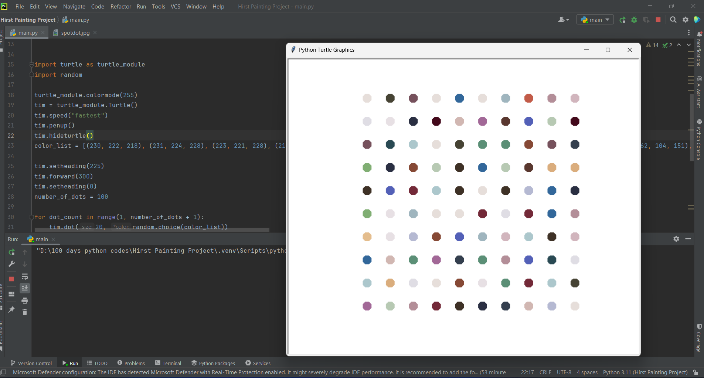

# Hirst Painting Project :-

# Project Description:

The Hirst Painting Project is a Python-based recreation of Damien Hirst's famous spot paintings. Damien Hirst, a contemporary British artist, is known for his series of spot paintings featuring rows of colored dots. This project uses Python's turtle graphics library to emulate Hirst's iconic style, creating a digital version of these colorful patterns.

# Objectives:

To learn and utilize Python's turtle module for creating graphical output.
To extract colors from an image using the colorgram library, ensuring a diverse and appealing color palette.
To implement a grid-based layout to position the dots systematically, resembling Hirst's meticulous arrangement.
To enhance programming skills in loops, conditional statements, and functions within Python.

# Features:

- # Color Extraction:

Uses the colorgram library to extract RGB values from an image, ensuring the dots' colors are varied and visually appealing.

- # Grid Layout:

Implements a systematic grid layout for positioning the dots, ensuring even spacing and alignment.

- # Random Color Selection:

Randomly selects colors from the extracted palette for each dot, providing a randomized yet aesthetically pleasing pattern.

- # User Interaction:

The program keeps the graphical window open until a user clicks to close it, allowing for an extended viewing experience.

# Workflow:

- # Setup:

Import necessary libraries (turtle and random).
Configure the turtle module for RGB color mode and create a Turtle object for drawing.

- # Color List Definition:

Define a list of RGB tuples extracted from an image using the colorgram library. This list represents the color palette used for the dots.

- # Positioning:

Set the initial position of the turtle to start drawing the grid from the bottom left corner of the screen.

- # Drawing the Dots:

Loop through a specified number of iterations to draw dots.
For each iteration, randomly select a color from the color list and draw a dot.
Move the turtle forward to position for the next dot.
After completing a row, reposition the turtle to start a new row.

- # Display:

Keep the graphical window open until the user clicks to close it.

# Code Example:
import turtle as turtle_module
import random

# Setup turtle module
turtle_module.colormode(255)
tim = turtle_module.Turtle()
tim.speed("fastest")
tim.penup()
tim.hideturtle()

# Color list (extracted using colorgram)
color_list = [(230, 222, 218), (231, 224, 228), (223, 221, 228), (218, 173, 125), 
              (159, 181, 190), (134, 73, 53), (50, 103, 154), (118, 81, 92), 
              (179, 142, 152), (162, 104, 151), (42, 47, 66), (128, 174, 115), 
              (83, 96, 183), (67, 9, 27), (82, 133, 107), (52, 63, 78), 
              (228, 189, 141), (194, 91, 72), (220, 226, 221), (62, 49, 38), 
              (115, 41, 56), (91, 143, 118), (70, 67, 52), (209, 181, 189), 
              (181, 185, 210), (209, 183, 178), (89, 55, 47), (183, 201, 179), 
              (172, 199, 204), (41, 73, 83)]

# Initial position
  tim.setheading(225)
  tim.forward(300)
  tim.setheading(0)

# Number of dots
  number_of_dots = 100

# Drawing dots
  for dot_count in range(1, number_of_dots + 1):
      tim.dot(20, random.choice(color_list))
      tim.forward(50)

    if dot_count % 10 == 0:
        tim.setheading(90)
        tim.forward(50)
        tim.setheading(180)
        tim.forward(500)
        tim.setheading(0)

# Keep screen open
  screen = turtle_module.Screen()
  screen.exitonclick()

# Conclusion:
The Hirst Painting Project provides a fun and creative way to explore Python's graphical capabilities using the turtle module. By replicating Damien Hirst's spot paintings, the project combines artistic expression with programming, offering an engaging learning experience for Python enthusiasts.

# Output:

<h1 align="center">
   <a href="https://google.com">
    
   
    
</h1>
